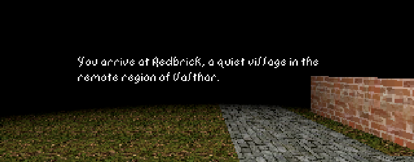

This is my first 3d first-person prototype. I learned how to use meshes, textures, lighting and audio in Godot.

The visuals are inspired by The Elder Scrolls: Arena, but there are some violations such as the ability to look up and down, camera perspective, and a higher framerate.

There isn't any gameplay, it's just of a tech prototype 🙂

Try it at https://mccxiv.itch.io/redbrick